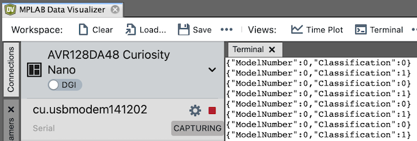

# Fan Condition Monitoring with the MPLAB® ML Development Suite
|  |
| :--: |
| Deployed fan condition monitor |

## Repository Overview
This repository is a companion to the [AVR DA Fan Condition Monitoring with MPLAB ML tutorial](https://onlinedocs.microchip.com/v2/keyword-lookup?keyword=MPLAB-ML-Fan-Demo&redirect=true). It contains the firmware to classify the operational state of a Honeywell HT-900 fan including whether the fan is on, what speed it's running at, and whether the fan is experiencing one of a handful of fault conditions (*tapping*, *shaking*, *unknown*). The demo project runs on the [AVR Curiosity Nano](https://www.microchip.com/developmenttools/ProductDetails/EV45Y33A) with the [Bosch BMI160 IMU](https://www.microchip.com/developmenttools/ProductDetails/EV45Y33A) ([Mikroe IMU2 click board](https://www.mikroe.com/6dof-imu-2-click)) or the [TDK ICM42688 IMU](https://www.microchip.com/DevelopmentTools/ProductDetails/PartNO/EV18H79A) ([Mikroe IMU14 click board](https://www.mikroe.com/6dof-imu-14-click)).

The fan states that the model can recognize (shown in the video above) are summarized below:

* *Unknown*
* *Fan Off*
* *Shaking*
* *Fan Speed 1*
* *Fan Speed 2*
* *Fan Speed 3*
* *Tapping*

## Hardware Used
* AVR128DA48 Curiosity Nano Evaluation Kit [(DM164151)](https://www.microchip.com/Developmenttools/ProductDetails/DM164151)
* Curiosity Nano Base for Click boards™ [(AC164162)](https://www.microchip.com/developmenttools/ProductDetails/AC164162)
* IMU 2 click board (https://www.mikroe.com/6dof-imu-2-click)
* IMU 14 click board (https://www.mikroe.com/6dof-imu-14-click)

## Software Used
* [MPLAB® X IDE](https://microchip.com/mplab/mplab-x-ide)
* [MPLAB® XC32 Compiler](https://microchip.com/mplab/compilers)
* [MPLAB® Harmony 3](https://www.microchip.com/harmony)
* [MPLAB® ML Model Builder](https://onlinedocs.microchip.com/v2/keyword-lookup?keyword=MPLAB-ML-Documentation&redirect=true)

# Data Collection
The [dataset](https://github.com/MicrochipTech/ml-avrda-cnano-mplabml-fan-condition-demo/tree/main/dataset/) used for the development of this application consists of 6-axis IMU recordings taken with the AVR Curiosity Nano + Curiosity Nano Base mounted to the housing of a Honeywell HT-900 fan. For further description of the application setup, see the [AVR DA Fan Condition Monitoring with MPLAB ML tutorial](https://onlinedocs.microchip.com/v2/keyword-lookup?keyword=MPLAB-ML-Fan-Demo&redirect=true).

## Data Collection Firmware
A binary build of the data logging firmware used in the data collection for this project can be found in the [binaries folder of this repo](https://github.com/MicrochipTech/ml-avrda-cnano-mplabml-fan-condition-demo/tree/main/binaries/); to build data logging firmware for different sensor configurations, visit the [ml-avrda-cnano-imu-data-logger](https://github.com/MicrochipTech/ml-avrda-cnano-imu-data-logger) repository.

## Sensor Configuration
The sensor configuration used in this demo is summarized in the table below. These settings can be changed by modifying app_config.h.

| IMU Sensor | Axes | Sampling Rate | Accelerometer Range | Gyrometer Range |
| --- | --- | --- | --- | --- |
| Bosch BMI160 | Ax, Ay, Az, Gx, Gy, Gz | 100Hz | 2G | 125DPS |

# Firwmare Operation
The firmware will reflect the state of operation of the demo using the onboard LEDs; this behavior is summarized in the table below.

| State | LED Behavior | Description |
| --- | --- | --- |
| Fan Off |	LED0 on |	Fan is not running. |
| Fan Speed 1/2/3 |	LED0 low/med/high speed blinking |	Fan is running normally. |
| Shaking |	LED0 fast blink	| Detected fan shaking. |
| Tapping/Unknown |	LED0 turbo blink	| Detected tapping or other abnormal behavior. |
| Firmware error | LED0 off |	Fatal error. (Do you have the correct sensor plugged in?). |
| Buffer overflow |	LED0 lit for 5 seconds | Processing is not able to keep up with real-time; data buffer has been reset. |

In addition, the firmware also prints the classification output for each inference over the UART port. To read the UART port output, use the terminal in MPLAB Data Visualizer.

- Baudrate 115200
- Data bits 8
- Stop bits 1
- Parity None

The terminal output should look similar to the figure shown below.

|  |
| :--: |
| UART Terminal Output |

Note that the output classification is given as an integer number which corresponds to the class ID; the class ID to class label mapping is described in the table below.

| Class ID | Class Name |
| --- | --- |
| 0 | *Unknown* |
| 1 | *Fan Off* |
| 2 | *Shaking* |
| 3 | *Fan Speed 1* |
| 4 | *Fan Speed 2* |
| 5 | *Fan Speed 3* |
| 6 | *Tapping* |

## Firmware Benchmark
Measured with the BMI160 sensor configuration, ``-O2`` level compiler optimizations, and 8MHz clock
- 62.7kB Flash
- 3.9kB RAM
- 150ms Inference time (average)
